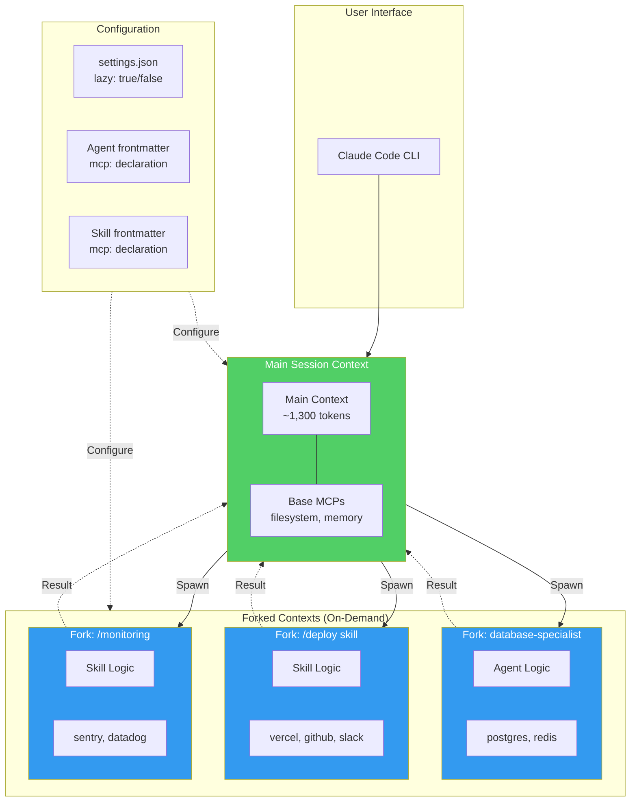
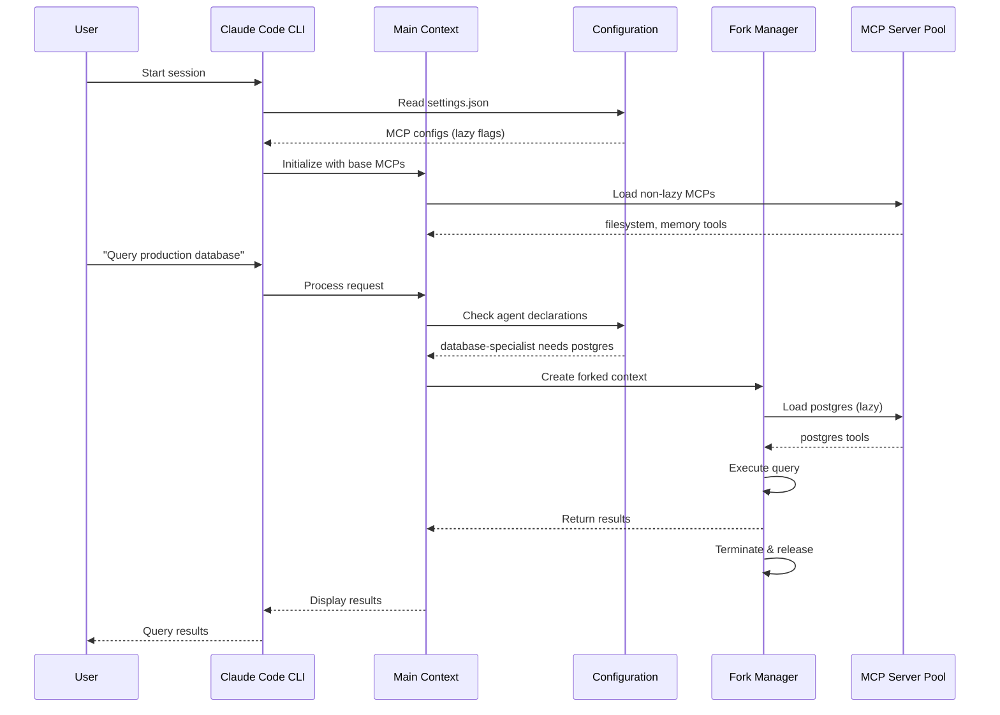
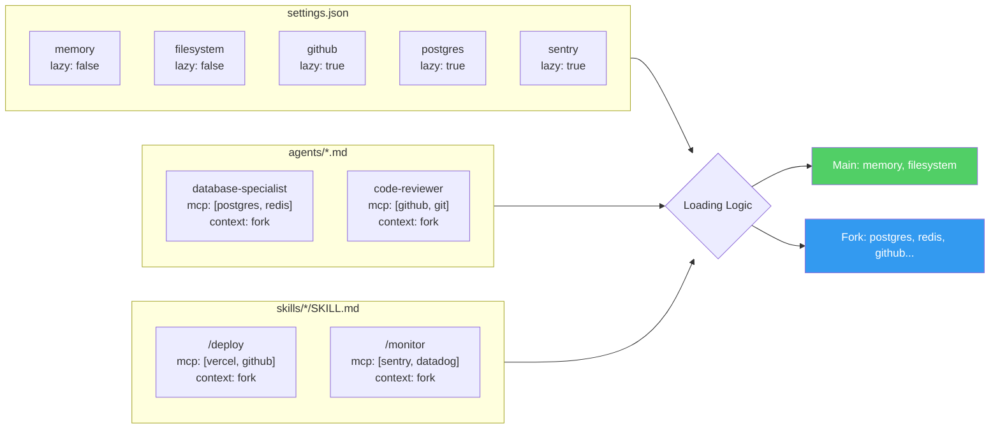
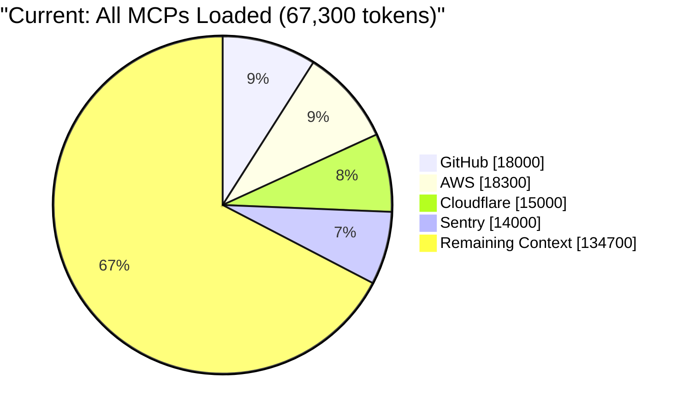
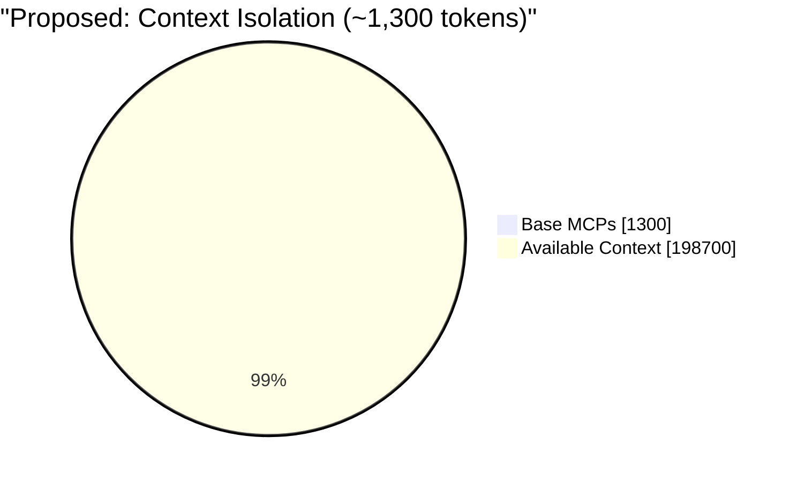
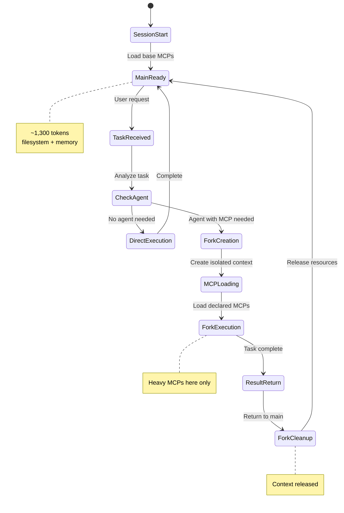
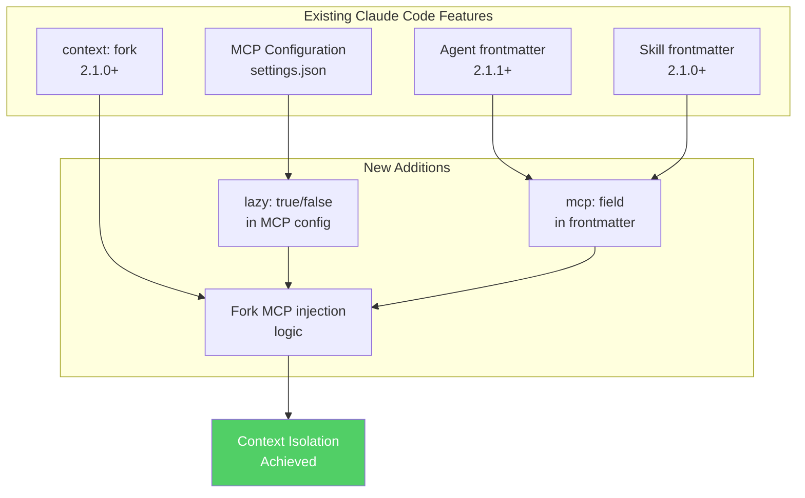

# Architecture Overview

## High-Level Architecture

```mermaid
graph TB
    subgraph User["User Interface"]
        CLI[Claude Code CLI]
    end

    subgraph Main["Main Session Context"]
        direction TB
        MC[Main Context<br/>~1,300 tokens]
        BM[Base MCPs<br/>filesystem, memory]
        MC --- BM
    end

    subgraph Forks["Forked Contexts (On-Demand)"]
        direction TB

        subgraph F1["Fork: database-specialist"]
            FA1[Agent Logic]
            FM1[postgres, redis]
        end

        subgraph F2["Fork: /deploy skill"]
            FA2[Skill Logic]
            FM2[vercel, github, slack]
        end

        subgraph F3["Fork: /monitoring"]
            FA3[Skill Logic]
            FM3[sentry, datadog]
        end
    end

    subgraph Config["Configuration"]
        S1[settings.json<br/>lazy: true/false]
        S2[Agent frontmatter<br/>mcp: declaration]
        S3[Skill frontmatter<br/>mcp: declaration]
    end

    CLI --> Main
    Main -->|Spawn| F1
    Main -->|Spawn| F2
    Main -->|Spawn| F3

    F1 -.->|Result| Main
    F2 -.->|Result| Main
    F3 -.->|Result| Main

    Config -.->|Configure| Main
    Config -.->|Configure| Forks

    style Main fill:#51cf66,color:#fff
    style F1 fill:#339af0,color:#fff
    style F2 fill:#339af0,color:#fff
    style F3 fill:#339af0,color:#fff
```

## Component Interaction

```mermaid
sequenceDiagram
    participant User
    participant CLI as Claude Code CLI
    participant Main as Main Context
    participant Config as Configuration
    participant Fork as Fork Manager
    participant MCP as MCP Server Pool

    User->>CLI: Start session
    CLI->>Config: Read settings.json
    Config-->>CLI: MCP configs (lazy flags)
    CLI->>Main: Initialize with base MCPs
    Main->>MCP: Load non-lazy MCPs
    MCP-->>Main: filesystem, memory tools

    User->>CLI: "Query production database"
    CLI->>Main: Process request
    Main->>Config: Check agent declarations
    Config-->>Main: database-specialist needs postgres
    Main->>Fork: Create forked context
    Fork->>MCP: Load postgres (lazy)
    MCP-->>Fork: postgres tools
    Fork->>Fork: Execute query
    Fork-->>Main: Return results
    Fork->>Fork: Terminate & release
    Main-->>CLI: Display results
    CLI-->>User: Query results
```

## Configuration Structure

```mermaid
graph LR
    subgraph SettingsJSON["settings.json"]
        direction TB
        MCP1["memory<br/>lazy: false"]
        MCP2["filesystem<br/>lazy: false"]
        MCP3["github<br/>lazy: true"]
        MCP4["postgres<br/>lazy: true"]
        MCP5["sentry<br/>lazy: true"]
    end

    subgraph Agents["agents/*.md"]
        direction TB
        A1["database-specialist<br/>mcp: [postgres, redis]<br/>context: fork"]
        A2["code-reviewer<br/>mcp: [github, git]<br/>context: fork"]
    end

    subgraph Skills["skills/*/SKILL.md"]
        direction TB
        S1["/deploy<br/>mcp: [vercel, github]<br/>context: fork"]
        S2["/monitor<br/>mcp: [sentry, datadog]<br/>context: fork"]
    end

    SettingsJSON --> LoadLogic{Loading Logic}
    Agents --> LoadLogic
    Skills --> LoadLogic

    LoadLogic --> Result1["Main: memory, filesystem"]
    LoadLogic --> Result2["Fork: postgres, redis, github..."]

    style Result1 fill:#51cf66,color:#fff
    style Result2 fill:#339af0,color:#fff
```

## Token Budget Visualization

```mermaid
pie showData
    title "Current: All MCPs Loaded (67,300 tokens)"
    "GitHub" : 18000
    "AWS" : 18300
    "Cloudflare" : 15000
    "Sentry" : 14000
    "Remaining Context" : 134700
```

```mermaid
pie showData
    title "Proposed: Context Isolation (~1,300 tokens)"
    "Base MCPs" : 1300
    "Available Context" : 198700
```

## System States

```mermaid
stateDiagram-v2
    [*] --> SessionStart

    SessionStart --> MainReady: Load base MCPs
    note right of MainReady: ~1,300 tokens<br/>filesystem + memory

    MainReady --> TaskReceived: User request
    TaskReceived --> CheckAgent: Analyze task

    CheckAgent --> DirectExecution: No agent needed
    CheckAgent --> ForkCreation: Agent with MCP needed

    DirectExecution --> MainReady: Complete

    ForkCreation --> MCPLoading: Create isolated context
    MCPLoading --> ForkExecution: Load declared MCPs
    ForkExecution --> ResultReturn: Task complete
    ResultReturn --> ForkCleanup: Return to main
    ForkCleanup --> MainReady: Release resources

    note right of ForkExecution: Heavy MCPs here only
    note right of ForkCleanup: Context released
```

## Integration Points

```mermaid
flowchart TB
    subgraph Existing["Existing Claude Code Features"]
        E1[context: fork<br/>2.1.0+]
        E2[Agent frontmatter<br/>2.1.1+]
        E3[Skill frontmatter<br/>2.1.0+]
        E4[MCP Configuration<br/>settings.json]
    end

    subgraph New["New Additions"]
        N1["lazy: true/false<br/>in MCP config"]
        N2["mcp: field<br/>in frontmatter"]
        N3["Fork MCP injection<br/>logic"]
    end

    E1 --> N3
    E2 --> N2
    E3 --> N2
    E4 --> N1

    N1 --> N3
    N2 --> N3

    N3 --> Result["Context Isolation<br/>Achieved"]

    style Result fill:#51cf66,color:#fff
```
