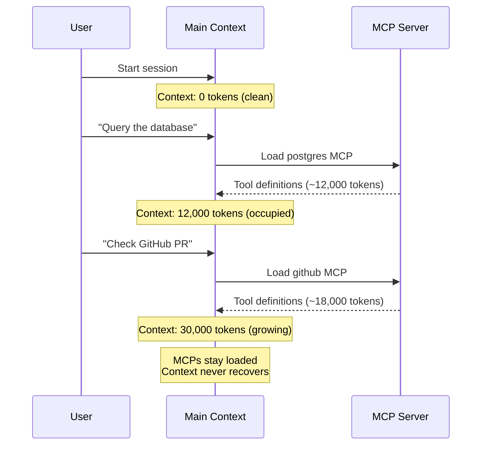
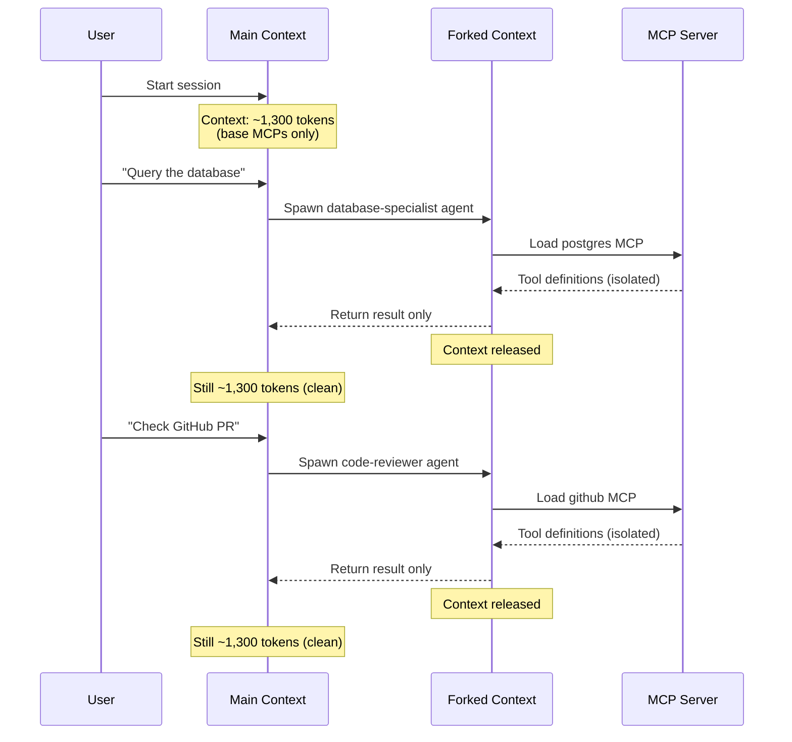
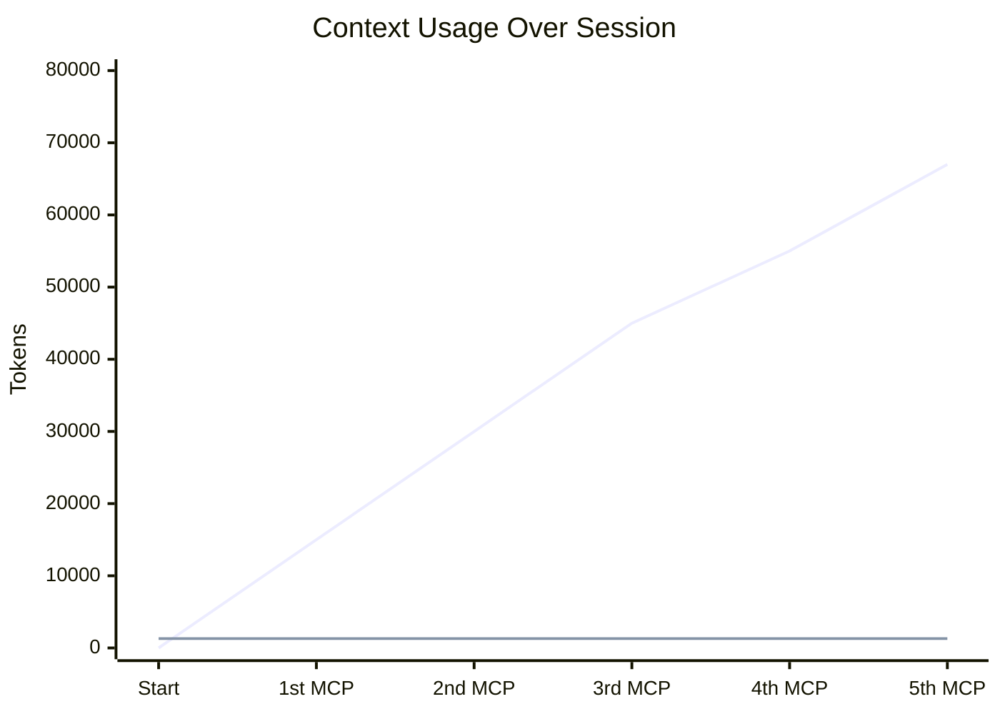

# Context Isolation vs Traditional Lazy Loading

## The Key Difference

Traditional lazy loading still pollutes the main context. Our proposal keeps the main context **permanently clean**.

## Traditional Lazy Loading

## Our Proposal: Context Isolation

## Side-by-Side Comparison

```mermaid
graph TB
    subgraph Traditional["Traditional Lazy Loading"]
        T1[Session Start] --> T2[Need Database]
        T2 --> T3[Load postgres into Main]
        T3 --> T4[Need GitHub]
        T4 --> T5[Load github into Main]
        T5 --> T6["Main Context: 30,000+ tokens"]
        style T6 fill:#ff6b6b,color:#fff
    end

    subgraph Isolation["Context Isolation (Our Proposal)"]
        I1[Session Start] --> I2[Need Database]
        I2 --> I3[Fork → Load postgres]
        I3 --> I4[Return result, release fork]
        I4 --> I5[Need GitHub]
        I5 --> I6[Fork → Load github]
        I6 --> I7[Return result, release fork]
        I7 --> I8["Main Context: ~1,300 tokens"]
        style I8 fill:#51cf66,color:#fff
    end
```

## Token Impact Over Time

