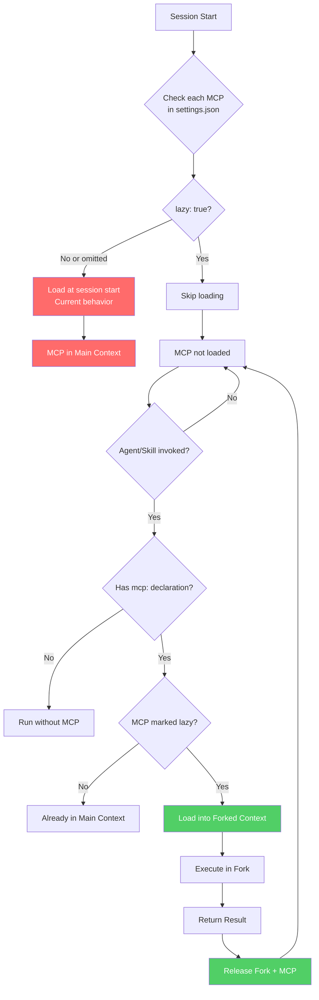
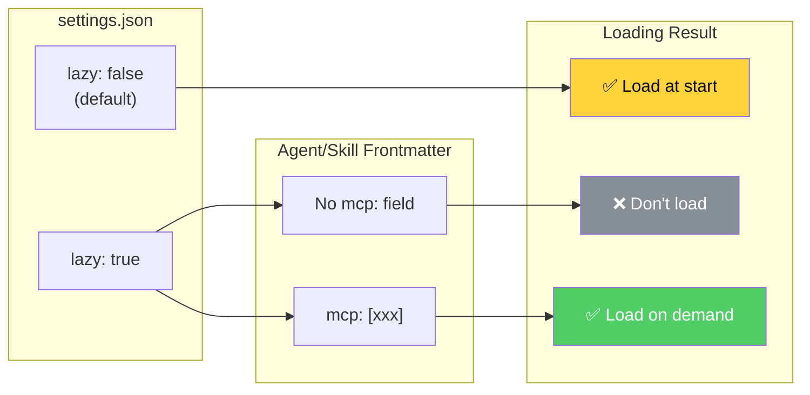
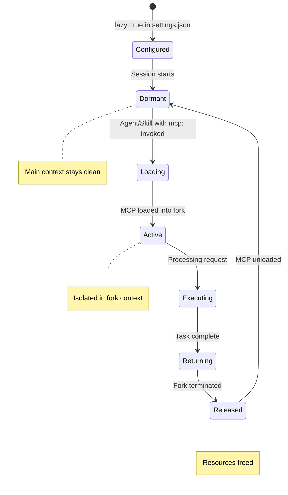
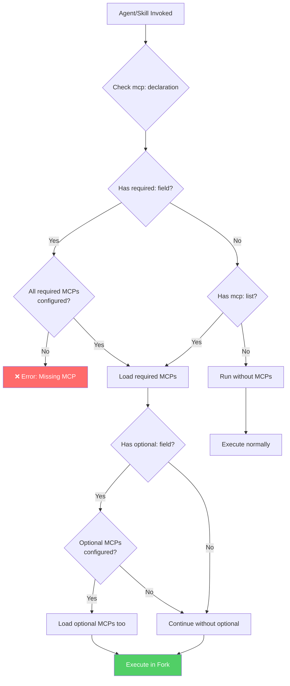

# MCP Loading Logic Flowchart

## Decision Flow

```mermaid
flowchart TD
    A[Session Start] --> B{Check each MCP<br/>in settings.json}

    B --> C{lazy: true?}

    C -->|No or omitted| D[Load at session start<br/>Current behavior]
    D --> E[MCP in Main Context]

    C -->|Yes| F[Skip loading]
    F --> G[MCP not loaded]

    G --> H{Agent/Skill invoked?}

    H -->|No| G
    H -->|Yes| I{Has mcp: declaration?}

    I -->|No| J[Run without MCP]
    I -->|Yes| K{MCP marked lazy?}

    K -->|No| L[Already in Main Context]
    K -->|Yes| M[Load into Forked Context]

    M --> N[Execute in Fork]
    N --> O[Return Result]
    O --> P[Release Fork + MCP]
    P --> G

    style D fill:#ff6b6b,color:#fff
    style E fill:#ff6b6b,color:#fff
    style M fill:#51cf66,color:#fff
    style P fill:#51cf66,color:#fff
```

## Configuration Decision Matrix

```mermaid
graph LR
    subgraph Settings["settings.json"]
        S1["lazy: false<br/>(default)"]
        S2["lazy: true"]
    end

    subgraph Declaration["Agent/Skill Frontmatter"]
        D1["No mcp: field"]
        D2["mcp: [xxx]"]
    end

    subgraph Result["Loading Result"]
        R1["✅ Load at start"]
        R2["❌ Don't load"]
        R3["✅ Load on demand"]
    end

    S1 --> R1
    S2 --> D1
    S2 --> D2
    D1 --> R2
    D2 --> R3

    style R1 fill:#ffd43b,color:#000
    style R2 fill:#868e96,color:#fff
    style R3 fill:#51cf66,color:#fff
```

## MCP Lifecycle in Forked Context

```mermaid
stateDiagram-v2
    [*] --> Configured: lazy: true in settings.json
    Configured --> Dormant: Session starts

    Dormant --> Loading: Agent/Skill with mcp: invoked
    Loading --> Active: MCP loaded into fork
    Active --> Executing: Processing request
    Executing --> Returning: Task complete
    Returning --> Released: Fork terminated
    Released --> Dormant: MCP unloaded

    note right of Dormant: Main context stays clean
    note right of Active: Isolated in fork context
    note right of Released: Resources freed
```

## Required vs Optional MCPs

```mermaid
flowchart TD
    A[Agent/Skill Invoked] --> B{Check mcp: declaration}

    B --> C{Has required: field?}
    C -->|Yes| D{All required MCPs<br/>configured?}
    D -->|No| E[❌ Error: Missing MCP]
    D -->|Yes| F[Load required MCPs]

    C -->|No| G{Has mcp: list?}
    G -->|Yes| F
    G -->|No| H[Run without MCPs]

    F --> I{Has optional: field?}
    I -->|Yes| J{Optional MCPs<br/>configured?}
    J -->|Yes| K[Load optional MCPs too]
    J -->|No| L[Continue without optional]
    I -->|No| L

    K --> M[Execute in Fork]
    L --> M
    H --> N[Execute normally]

    style E fill:#ff6b6b,color:#fff
    style M fill:#51cf66,color:#fff
```
