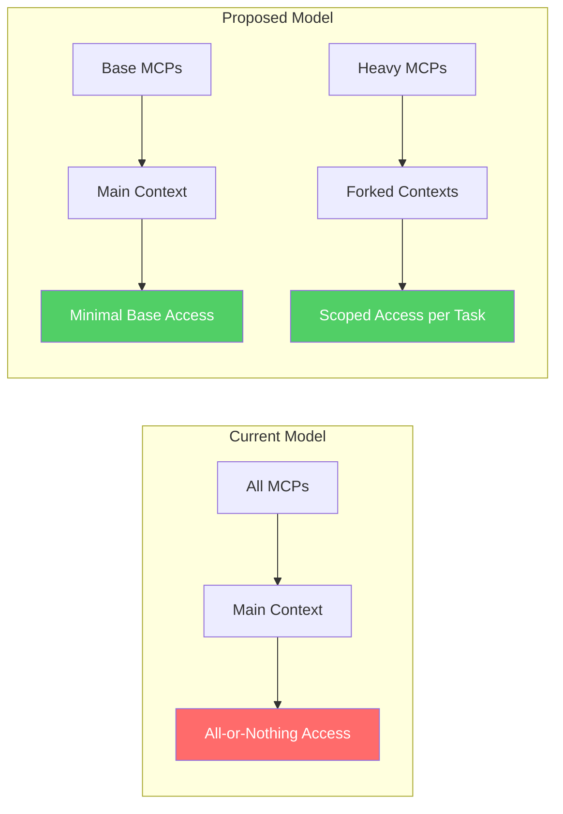
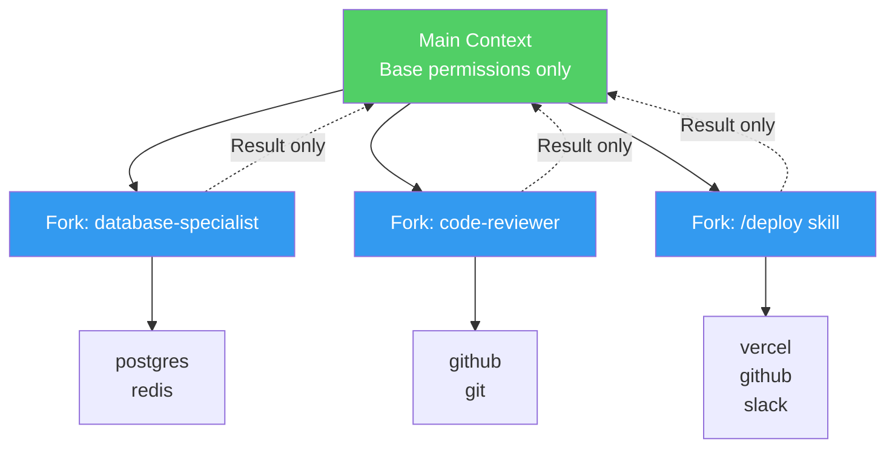
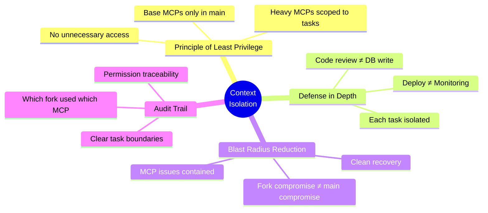

# Progressive Permission Layers

## Layered Security Model

```mermaid
graph TB
    subgraph L0["Layer 0: Main Context (Minimal)"]
        M1[filesystem<br/>read-only]
        M2[memory<br/>project knowledge]
    end

    subgraph L1["Layer 1: Development Agents"]
        A1[code-reviewer<br/>+ git read]
        A2[debugger<br/>+ bash sandboxed]
        A3[test-runner<br/>+ jest/pytest]
    end

    subgraph L2["Layer 2: Specialized Skills"]
        S1[/deploy<br/>+ vercel, github push]
        S2[/db-migrate<br/>+ postgres write]
        S3[/monitoring<br/>+ sentry, datadog]
    end

    subgraph L3["Layer 3: Admin Operations"]
        AD1[/production-access<br/>all MCPs + confirmation]
        AD2[/infrastructure<br/>aws, cloudflare]
    end

    L0 --> L1
    L1 --> L2
    L2 --> L3

    style L0 fill:#51cf66,color:#fff
    style L1 fill:#339af0,color:#fff
    style L2 fill:#ffd43b,color:#000
    style L3 fill:#ff6b6b,color:#fff
```

## Access Control Comparison



## Permission Inheritance



## Security Benefits



## Real-World Permission Example

```mermaid
flowchart LR
    subgraph User Request
        U1["Review this PR<br/>and deploy if good"]
    end

    subgraph Execution
        U1 --> T1[code-reviewer agent]
        T1 --> R1{Review passed?}
        R1 -->|Yes| T2[/deploy skill]
        R1 -->|No| END1[Report issues]
    end

    subgraph Fork1["Fork 1: code-reviewer"]
        T1 --> M1[github read-only]
        T1 --> M2[git read-only]
    end

    subgraph Fork2["Fork 2: /deploy"]
        T2 --> M3[github push]
        T2 --> M4[vercel deploy]
        T2 --> M5[slack notify]
    end

    T2 --> END2[Deploy complete]

    style Fork1 fill:#e7f5ff,stroke:#339af0
    style Fork2 fill:#fff3bf,stroke:#ffd43b
```
